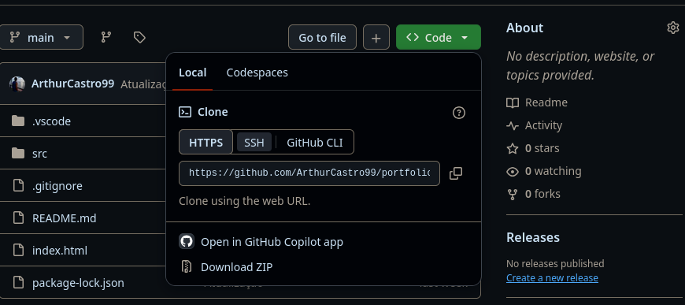

# Projeto Portfólio

> Repositório oficial do meu portfólio pessoal: [portfolio-arthurscdev](https://github.com/arthurscdev/portfolio-arthur-castro)

## Sobre Mim

Olá! Sou o **Arthur**, desenvolvedor Front-end com experiência no desenvolvimento de aplicações utilizando **HTML5, CSS3, JavaScript (ES6+) e React**.

Utilizo **Git** para versionamento de código e o **GitHub** para hospedar meus projetos e acompanhar novas tecnologias. Tenho facilidade e experiência com sistemas operacionais Windows e Linux (atualmente utilizando Fedora Workstation).

No momento, estou cursando **Análise e Desenvolvimento de Sistemas (EAD)** e expandindo meus conhecimentos para o Back-end, com foco em **Node.js, Express, PostgreSQL e APIs REST**.

---

## 💻 Sobre o Projeto

O objetivo deste projeto é apresentar minhas habilidades técnicas, expor meus principais projetos e contar um pouco sobre minha trajetória.

A interface foi desenvolvida com **HTML, CSS e JavaScript puro**, contando com layout totalmente responsivo (adaptado para dispositivos móveis e desktops).

📄 **[Visualizar meu Currículo em PDF](https://drive.google.com/file/d/1KWIg4bjw-WJLmqDow7XGlTTGh58OEewE/view)**

---

## 🛠️ Tecnologias Utilizadas

- **HTML5**
- **CSS3**
- **JavaScript (ES6+)**

> **Próximos passos (v3.0):** Em uma futura atualização, o projeto será reestruturado utilizando **Vite** e **React**.

---

## 📥 Como Clonar e Executar o Projeto

Fique à vontade para testar, clonar ou sugerir melhorias no projeto!

### Passo a passo para Download:

1. Acesse o [Repositório no GitHub](https://github.com/arthurscdev/portfolio-arthurscdev).
2. Clique no botão verde **`< > Code`**.
3. Escolha a opção **Download ZIP** ou copie a URL HTTPS para clonar.



> ⚠️ **Aviso:** Caso vá clonar o repositório via terminal, prefira utilizar a URL no protocolo **HTTPS**.

```bash
# Clonar o repositório via terminal
git clone
```

[https://github.com/arthurscdev/portfolio-arthurscdev.git](https://github.com/arthurscdev/portfolio-arthurscdev.git)

## Contato

Eu gosto muito de ouvir e ler opiniões que me ajudam a aprender e evoluir, então se você tiver algo para falar sobre os meus projetos, me envie mensagem por um desses links :

📱 : [**Instagram**](https://www.instagram.com/arthurscdev/)

💻 : [**Linkedin**](https://www.linkedin.com/in/arthur-sc/)
